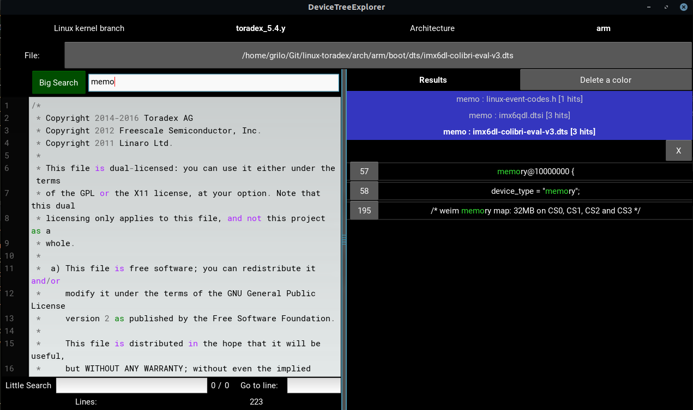

# DeviceTreeExplorer
A python-kivy project to help exploring a device tree hierarchy

## How to install dependencies on Linux (tested on Ubuntu 20.04)

I strongly advise to install inside a [Mini]Conda environment :)

1. Install [Mini]Conda: https://waylonwalker.com/install-miniconda/
2. Install Kivy:  [`conda install kivy -c conda-forge`](https://kivy.org/doc/stable/gettingstarted/installation.html)
3. Install other dependencies:
   - `gitpython`
   - `colour`

## How to download the source

1. Clone this repository and initialize its git submodules

``` bash
git clone --recurse-submodules https://github.com/griloHBG/DeviceTreeExplorer
```

## How to use

1. Navigate to the `arch/<architecture>/boot/dts` of your local kernel repository
2. Run the `main.py` and pass a `*.dtsi` or `*.dts` (prefferably) as argument

   Ex:
   ```
   $ conda activate 
   $ alias device-tree-explorer="python3 /home/grilo/DeviceTreeExplorer/main.py"
   $ cd linux-toradex/arch/arm/boot/dts
   $ device-tree-explorer imx6dl-colibri-eval-v3.dts
   ```
   Or:
   ```
   $ conda activate 
   $ alias device-tree-explorer="python3 /home/grilo/DeviceTreeExplorer/main.py"
   $ device-tree-explorer /home/grilo/linux-toradex/arch/arm/boot/dts/imx6dl-colibri-eval-v3.dts
   ```
5. (hopefully :p) The GUI will open
   
6. Top:
   - Current kernel branch (`toradex_5.4.y` in the example above)
   - To which architecture the current file belongs (`arm` in the example above)
   - Path to the file current opened: clicking here, you can navigate and open another files
     - TODO: recently opened files :)
     - TODO: highlight *.dts files with different color
7. Left:
   - The content of the current opened file (there is no way to save modifications)
   - Big Search: recursively search on **all directly or indirectly included files** (the result is shown on the right) 
   - Little Search: to search only inside the opened file (the usual text search)
   - Go to line by its line number
     - TODO: sanity check on input
   - Amount of lines of the current file
8. Right:
   - Delete all results generated by a single search
   - Take a look at all hits according to the string searched
      - Click on the line number to go to a specific search hit
      - It is possible to delete all results from a single file
9. The vertical divisor is draggable
